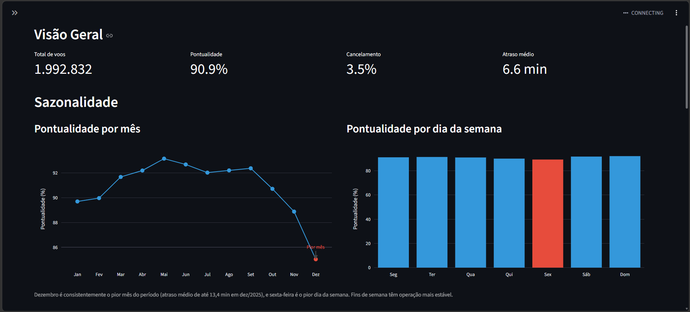
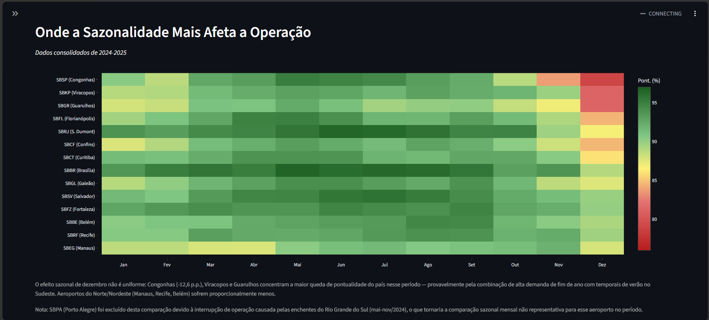
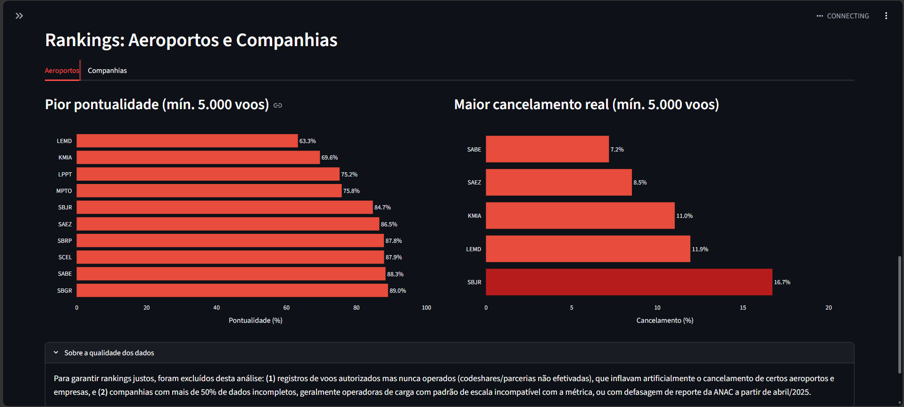

# SQL Operações — Análise de Voos ANAC

## Objetivo

Analisar dados públicos de voos da aviação civil brasileira (ANAC) para identificar padrões de atraso e cancelamento por companhia aérea, aeroporto e período, usando SQL para consultas analíticas e Streamlit para visualização de KPIs operacionais.

## Fontes de Dados

- **Voo Regular Ativo (VRA):** ANAC, Dados Abertos, dados mensais em CSV. Período: janeiro/2024 a dezembro/2025 (24 meses, ~2 milhões de registros).
- Dicionário de dados oficial disponível em `sql/dicionario_dados_vra.md`.

## Modelo de Dados e Views SQL

Pipeline em camadas, com cada etapa documentada em `sql/`:

- **vw_voos_analitico**: view base com categorização de atraso (Pontual, Antecipado, Atraso 30-60/60-120/120-240/>240, Cancelado, Sem horário previsto)
- **vw_voos_operacionais**: view derivada, excluindo registros de codeshare/autorização não operada (cancelamento >=85%) que distorciam rankings de aeroportos e companhias
- Arquivos sql/02 a sql/06: KPIs gerais, sazonalidade, análise por aeroporto, por companhia, e cruzamento aeroporto+mês

## Páginas do Dashboard

### 1. Visão Geral e Sazonalidade

[Adicione aqui: ]

KPIs gerais (pontualidade, cancelamento, atraso médio) com filtro por ano, gráfico de pontualidade por mês e por dia da semana.

### 2. Cruzamento Aeroporto x Mês

[Adicione aqui: ]

Mapa de calor mostrando onde o efeito sazonal de dezembro mais impacta a operação, por aeroporto.

### 3. Rankings: Aeroportos e Companhias

[Adicione aqui: ]

Piores aeroportos em pontualidade e cancelamento real, ranking de companhias aéreas, com nota sobre tratamento de qualidade de dados.

## Principais Conclusões

- **Pontualidade geral de 90,87%**, com melhora consistente de 2024 (90,14%) para 2025 (91,63%) em todos os indicadores.
- **Dezembro é consistentemente o pior mês** do período (atraso médio de até 13,4 min em dez/2025), e **sexta-feira é o pior dia da semana**.
- **O efeito sazonal de dezembro não é uniforme**: Congonhas (-12,6 p.p.), Viracopos e Guarulhos concentram a maior queda de pontualidade do país nesse período — provavelmente pela combinação de alta demanda de fim de ano com temporais de verão no Sudeste. Aeroportos do Norte/Nordeste sofrem proporcionalmente menos.
- **SBJR (Jacarepaguá) lidera cancelamento real** (16,7%) após remoção de registros de codeshare não operados.
- **GLO, TAM e AZU** (as três grandes nacionais) lideram o ranking de pontualidade entre companhias com volume relevante.

## Qualidade dos Dados

Este projeto envolveu três correções significativas de qualidade de dado, cada uma validada com queries de diagnóstico antes de ser aplicada:

1. Bug de categorização de voos sem horário previsto (118 mil registros classificados incorretamente como atraso extremo)
2. Exclusão de registros de codeshare/autorização não operada que distorciam rankings de aeroportos e companhias
3. Identificação de lacuna de reporte da ANAC a partir de abril/2025 (dobro da taxa histórica de dados sem horário previsto)

## Status do projeto

✅ Concluído — dashboard Streamlit com 4 seções, ~2 milhões de registros analisados, pipeline de ingestão automatizado, 3 correções de qualidade de dado documentadas.

## Estrutura do repositório

- `data/raw` — CSVs brutos da ANAC (VRA, 2024-2025)
- `data/processed` — banco SQLite gerado (não versionado, gerado automaticamente pelo app)
- `sql` — queries e views SQL, documentadas em ordem numérica
- `notebooks` — script de ingestão dos dados
- `app` — dashboard Streamlit
- `docs` — prints do dashboard

## Tecnologias

- Python (Pandas)
- SQL (SQLite)
- Streamlit, Plotly
- Git/GitHub

## Como Reproduzir

1. Clone o repositório
2. Instale as dependências: `pip install -r requirements.txt`
3. Rode `streamlit run app/main.py` — o banco SQLite é gerado automaticamente na primeira execução a partir dos CSVs em `data/raw`

## Autor

Lucas — estudante de Ciência da Computação (UNINTER), em transição de Operações para Dados/Analytics.
